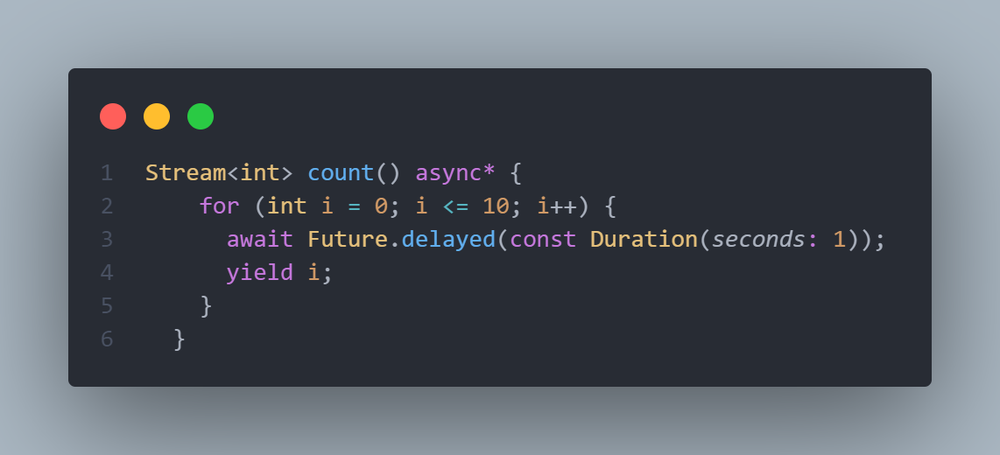

# Latihan BLoC Flutter State Management

Repo sebagai dokumentasi saya belajar state management BloC Flutter

## #1 Stream

- Adalah cara untuk mengirim dan menerima data secara asinkron. `Stream` ini bekerja seperti aliran data yang terus menerus mengalir dari satu sumber ke sumber lainnya.

## #2 Basic Cubit

- `BloC` & `Cubit` adalah cara atau metode yang digunakan untuk mengelola keadaan (state management) dalam aplikasi Flutter.
- `Bloc` adalah cara yang kuat dan fleksibel
- `Cubit` adalah cara yang lebih sederhana

