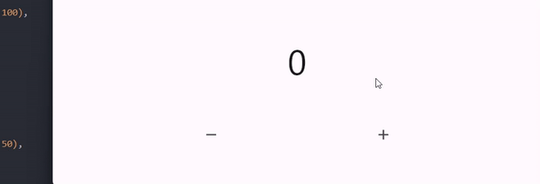

# Latihan BLoC Flutter State Management

Repo sebagai dokumentasi saya belajar state management BloC Flutter.

## #1 Stream

- Adalah cara untuk mengirim dan menerima data secara asinkron. `Stream` ini bekerja seperti aliran data yang terus menerus mengalir dari satu sumber ke sumber lainnya.

```
Stream<int> count() async* {
  for (int i = 0; i <= 10; i++) {
    await Future.delayed(const Duration(seconds: 1));
    yield i;
  }
}
```

## #2 Basic Cubit

- `BloC` & `Cubit` adalah cara atau metode yang digunakan untuk mengelola keadaan (state management) dalam aplikasi Flutter.
- `Bloc` adalah cara yang kuat dan fleksibel.
- `Cubit` adalah cara yang lebih sederhana.

```
class Counter extends Cubit<int> {
  Counter() : super(0); //initial value

  void incerement() {
    emit(state + 1);
  }

  void decrement() {
    emit(state - 1);
  }
}
```

## #3 Observer Cubit

- Membantu dalam mengelola dan mengawasi perubahan data (state) dalam aplikasi.

```
int? current;
int? next;

@override
void onChange(Change<int> change) {
  super.onChange(change);
  current = change.currentState;
  next = change.nextState;
}
```

## #4 Bloc Builder

- Adalah widget yang digunakan dalam Flutter untuk mengintegrasikan `BLoC` dengan ui.
- `StreamBuilder` bekerja dengan aliran data (`Stream`).

```
stream: myBloc.stream,
```

- `BlocBuilder` dirancang khusus untuk bekerja dengan BLoC, yang memisahkan logika bisnis dari tampilan.
- Terdapat 2 parameter penting yaitu `bloc` (bloc class) & `builder` (state yang dibangun).
- Dan terdapat satu parameter uniq dalam `BlocBuilder` yaitu `buildWhen` (Mengontrol kondisi kapan builder function dalam `BlocBuilder` harus dipanggil).
- Contoh implementasi sederhana `BlockBuilder` dengan studi kasus hanya ingin mencetak angka genap:

```
BlocBuilder<CounterBlock, int>(
  bloc: myCounter,
  buildWhen: (previous, current){
    if(current $ 2 == 0){
      return true;
    } else {
      return false;
    }
  }
  builder: (context, state) {
    return Text(
      '$state',
      style: const TextStyle(fontSize: 50),
    );
  },
),
```


## #5 Bloc Listener

- `BlocListener` adalah sebuah widget yang digunakan untuk _mendengarkan perubahan dalam Bloc yang terkait_ dan menjalankan tindakan tertentu saat perubahan terjadi.
- Memiliki properti uniq `listenWhen` yang fungsinya sama seperti `buildWhen` pada `BlockBuilder` yaitu state akan dijalankan ketika ada kondisi tertentu.
- Contoh implementasi sederhana `BlocListener`, ketika state berubah maka akan muncul snackBar:

```
/**
 * blockListener mendengarkan -> blockBuilder
 * listener akan merespon dalam bentuk snackbar
 */
BlocListener<CounterBloc, int>(
  bloc: myCounter,
  listener: (context, state) {
    ScaffoldMessenger.of(context).showSnackBar(
      const SnackBar(
        content: Text('Dijalankan'),
      ),
    );
  },
  child: BlocBuilder<CounterBloc, int>(
    bloc: myCounter,
    builder: (context, state) {
      return Text(
        '$state',
        style: const TextStyle(fontSize: 50),
      );
    },
  ),
),
```



## #6 Bloc Consumer

- Secara sederhana `BlocConsumer` adalah gabungan antara `BlocBuilder` dan `BlocListener`.
- Di dalam `BlocConsumer` terdapat properti penting yaitu: `builder`, `buildWhen`, `listen`, dan `listenWhen`.
- Contoh implementasi sederhana `BlocConsumer`, ketika state berubah maka akan muncul snackBar:

```
BlocConsumer<CounterBloc, int>(
  bloc: myCounter,
  builder: (context, state) {
    return Text(
      '$state',
      style: const TextStyle(fontSize: 50),
    );
  },
  listener: (context, state) {
    ScaffoldMessenger.of(context).showSnackBar(
      const SnackBar(
        duration: Duration(milliseconds: 100),
        content: Text('Dijalankan'),
      ),
    );
  },
),
```

## #7 Bloc Provider

- Muncul atas permasalahan ketika kita memecah suatu widget maka widget yang di pecah tersebut akan membutuhkan data dari widget yang diatasnya dengan cara melempar data menggunakan construktor, dari kejadian tersebut maka `BlocProvider` digunakan agar membuat code kita menjadi efisien.
- Dari code sebelumnya kita akan memecah widget state menjadi 2 bagian yang terpisah dimulai dari `HomePage`: 1. `DataState` berisi container dengan child widget `ValueState`, 2. `ValueState` berisi nilai state yang berubah pada tampilan ui.
- Alur widget nya yaitu: `MaterialApp` -> `Scaffold` -> `Box` -> `Text`.
- Berikut implementasi sederhananya:

Daftarkan `BlocProvider` pada `MaterialApp`

```
BlocProvider(
  create: (context) => MyBlocProvider(),
  child: MaterialApp(
    home: MyHomePage(),
  ),
);
```

Gunakan pada setiap widget yang membutuhkan data state

```
//inisiasi objek Bloc class
final myCounter = BlocProvider.of<CounterBloc>(context);

return BlocBuilder<CounterBloc, int>(
  bloc: myCounter,
  builder: (context, state) {
    return Text(
      '$state',
      style: const TextStyle(fontSize: 50),
    );
  },
);
```

## #8 Bloc Provider Value

- Mengabil nilai dari halaman HomePage dan ditampilkan di halaman ValueDetail `BlocProvider.value()`,
- berikut implementasi sederhananya:

```
Navigator.of(context).push(
  MaterialPageRoute(
    builder: (context) => BlocProvider.value(
      value: myCounter,
      child: const ValuePage(),
    ),
  ),
);
```
