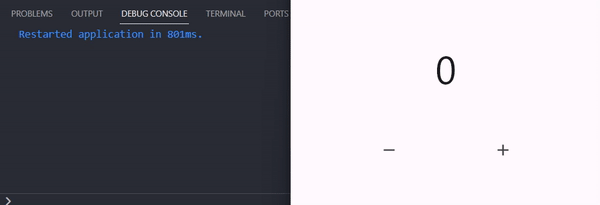

# Latihan BLoC Flutter State Management

Repo sebagai dokumentasi saya belajar state management BloC Flutter.

## #1 Stream

- Adalah cara untuk mengirim dan menerima data secara asinkron. `Stream` ini bekerja seperti aliran data yang terus menerus mengalir dari satu sumber ke sumber lainnya.

```
Stream<int> count() async* {
  for (int i = 0; i <= 10; i++) {
    await Future.delayed(const Duration(seconds: 1));
    yield i;
  }
}
```

## #2 Basic Cubit

- `BloC` & `Cubit` adalah cara atau metode yang digunakan untuk mengelola keadaan (state management) dalam aplikasi Flutter.
- `Bloc` adalah cara yang kuat dan fleksibel.
- `Cubit` adalah cara yang lebih sederhana.

```
class Counter extends Cubit<int> {
  Counter() : super(0); //initial value

  void incerement() {
    emit(state + 1);
  }

  void decrement() {
    emit(state - 1);
  }
}
```

## #3 Observer Cubit

- Membantu dalam mengelola dan mengawasi perubahan data (state) dalam aplikasi.

```
int? current;
int? next;

@override
void onChange(Change<int> change) {
  super.onChange(change);
  current = change.currentState;
  next = change.nextState;
}
```


## #4 Bloc Builder

- Adalah widget yang digunakan dalam Flutter untuk mengintegrasikan `BLoC` dengan ui.
- `StreamBuilder` bekerja dengan aliran data (`Stream`).

```
stream: myBloc.stream,
```

- `BlocBuilder` dirancang khusus untuk bekerja dengan BLoC, yang memisahkan logika bisnis dari tampilan.
- Terdapat 2 parameter penting yaitu `bloc` (bloc class) & `builder` (state yang dibangun).
- Dan terdapat satu parameter uniq dalam `BlocBuilder` yaitu `buildWhen` (Mengontrol kondisi kapan builder function dalam `BlocBuilder` harus dipanggil).
- contoh implementasi sederhana `BlockBuilder` dengan studi kasus hanya ingin mencetak angka genap:

```
BlocBuilder<CounterBlock, int>(
  bloc: myCounter,
  buildWhen: (previous, current){
    if(current $ 2 == 0){
      return true;
    } else {
      return false;
    }
  }
  builder: (context, state) {
    return Text(
      '$state',
      style: const TextStyle(fontSize: 50),
    );
  },
),
```


